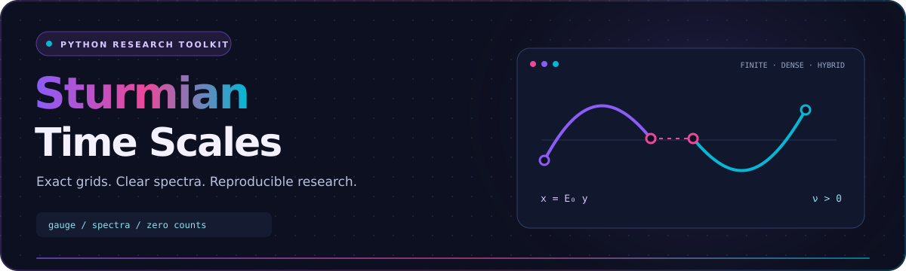
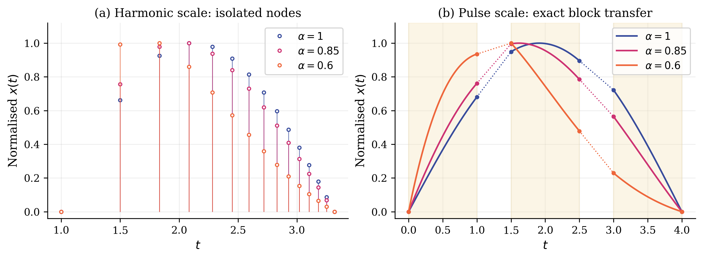
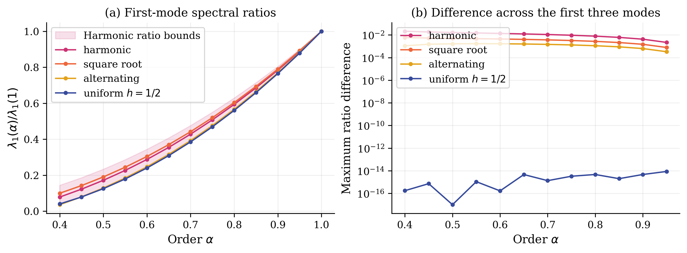
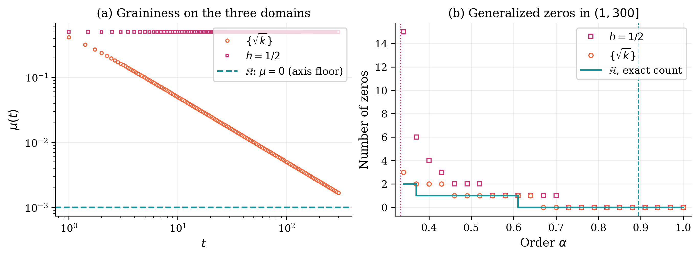
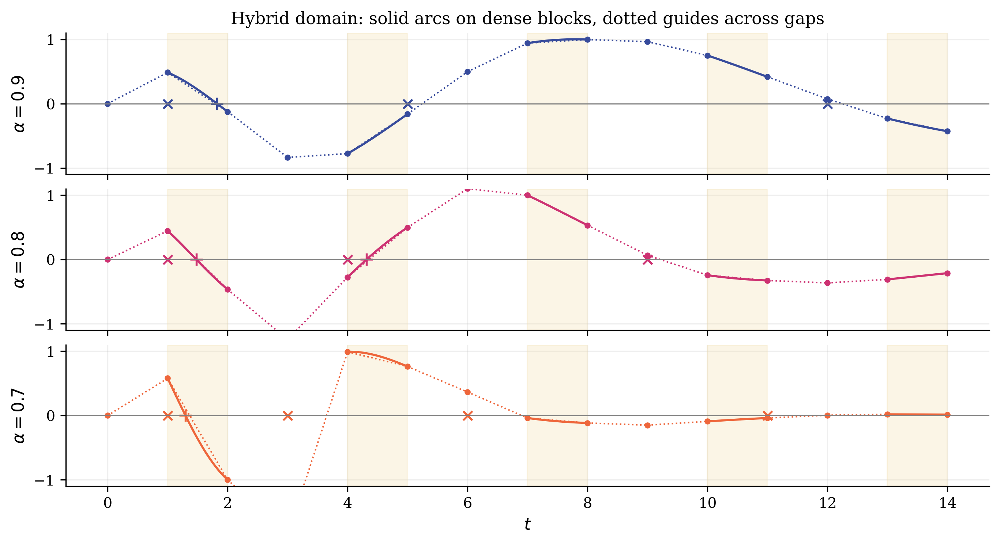
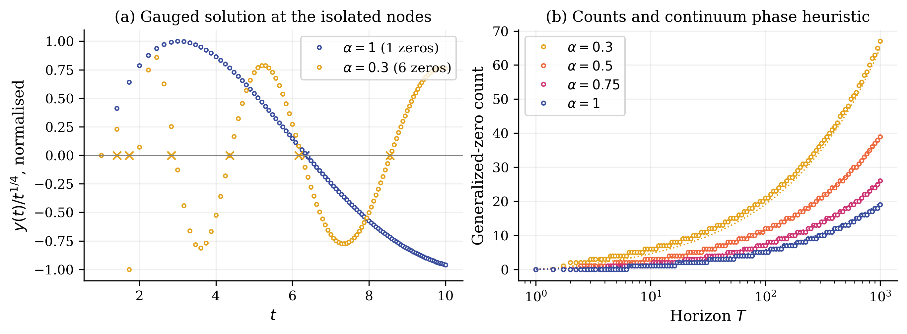
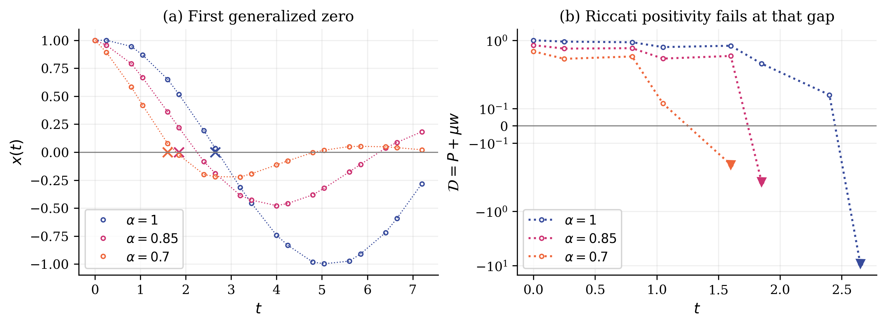
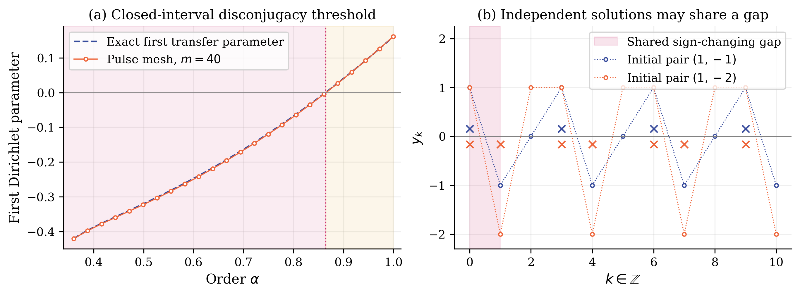
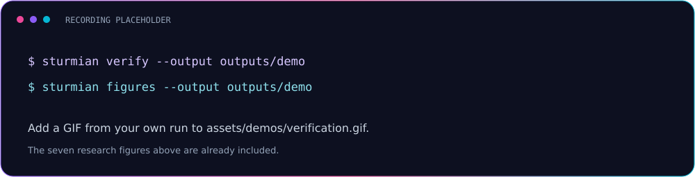

<div align="center">



<a href="https://github.com/Khuddush89/Sturmian-Time-Scales">
  
</a>

[](https://github.com/Khuddush89/Sturmian-Time-Scales/actions/workflows/ci.yml)
[](CHANGELOG.md)
[](LICENSE)
[](CONTRIBUTING.md)
[](https://github.com/Khuddush89/Sturmian-Time-Scales/stargazers)
[](https://github.com/Khuddush89/Sturmian-Time-Scales/forks)

**A reproducible numerical supplement for proportional conformable dynamic equations.**

[Quick start](#-quick-start) · [Figures](#-figures-and-demos) · [Mathematics](docs/mathematics.md) · [Verification](docs/reproducibility.md)

</div>


## 🚀 Overview

Explore Sturmian spectra and generalized zeros on harmonic, square-root,
alternating, pulse, and hybrid time scales. The code pairs exact finite identities
with numerical experiments and seven reproducible figures.

The computations accompany *Gauge Reduction and Sturmian Consequences for
Proportional Conformable Dynamic Equations on Time Scales*.
See [provenance](docs/provenance.md) for the scope of this supplement.

### 🧭 Contents

- [✨ Features](#-features)
- [🛠️ Tech stack](#-tech-stack)
- [📦 Quick start](#-quick-start)
- [📸 Figures and demos](#-figures-and-demos)
- [🧪 Verification](#-verification)
- [🗂️ Repository map](#-repository-map)
- [🤝 Contributing](#-contributing)
- [📈 Community and star history](#-community-and-star-history)
- [📜 License and citation](#-license-and-citation)

## ✨ Features

| | Capability | Evidence / output |
| :---: | :--- | :--- |
| 🔮 | Positive gauge reduction with variable gains | Exact rational examples and seeded identity checks |
| 🎼 | Finite Dirichlet spectra and eigenfunctions | Symmetric tridiagonal pencils and mass orthogonality |
| 🔢 | Generalized-zero counts | Nodal zeros and strict crossings across contained gaps |
| 🌉 | Dense-block and jump transfer | Pulse thresholds and hybrid state comparisons |
| 📐 | Independent high-precision checks | 80-digit Decimal calculations |
| 📊 | Reproducible research figures | Seven PNGs with accompanying CSV data |
| 🧪 | Explicit verification evidence | 535 assertions with recorded residuals and tolerances |

## 🛠️ Tech stack

[](pyproject.toml)

**Python 3.11+ · NumPy · SciPy · Matplotlib · pytest · Ruff**

Exact arithmetic uses Python's `fractions` and `decimal` modules.
The [reference dependency versions](requirements.txt) reproduce the bundled run.

## 📦 Quick start

```bash
git clone https://github.com/Khuddush89/Sturmian-Time-Scales.git
cd Sturmian-Time-Scales
python -m venv .venv
source .venv/bin/activate
python -m pip install -r requirements.txt
python -m pip install -e .
sturmian verify --output outputs/reference
sturmian figures --output outputs/reference
```

On Windows PowerShell, activate with `.venv\Scripts\Activate.ps1`.
Both commands also work as `python -m sturmian verify` and `python -m sturmian figures`.

```python
from sturmian.model import harmonic, spectrum

grid = harmonic(15)
eigenvalues = spectrum(grid, alpha=0.75)
print(eigenvalues[:3])
```

Runs write CSVs, PNGs, and a JSON verification report under the chosen output
directory. The committed `data/` and `assets/screenshots/` provide reference results.

## 📸 Figures and demos

| Eigenfunctions on two domains | Spectral ratios |
| :---: | :---: |
|  |  |

<details>
<summary>🖼️ Open the complete seven-figure gallery</summary>

| Figure | Preview |
| :--- | :--- |
| 3 · Euler zero counts |  |
| 4 · Hybrid dynamics |  |
| 5 · Square-root scale |  |
| 6 · Riccati sign loss |  |
| 7 · Disconjugacy |  |

</details>

<details>
<summary>🎬 Recording and screenshot placeholders</summary>



Add your recording as `assets/demos/verification.gif` and replace the placeholder
link. Additional screenshot slots are listed in [assets/README.md](assets/README.md).

</details>

Solid arcs belong to dense blocks. Dotted gap connectors are guides;
they assign no solution values inside missing intervals.

## 🧪 Verification

```bash
python -m pip install -r requirements-dev.txt
ruff check .
ruff format --check .
pytest -q
```

`pytest` runs analytical-limit and boundary-convention tests, then the full
535-assertion audit. For a shorter development loop, use `pytest -q -m "not slow"`.

CI checks Python 3.11, 3.12, and 3.13, builds an installable wheel,
and regenerates all seven figures. Its downloadable artifact contains fresh results.

The suite checks finite identities and numerical assertions. General statements
and infinite-horizon results require mathematical proofs; see [the conventions](docs/mathematics.md).

## 🗂️ Repository map

| Path | Purpose |
| :--- | :--- |
| [`src/sturmian/`](src/sturmian/) | Model, verification engine, figure generator, and CLI |
| [`tests/`](tests/) | Analytical, domain, CLI, and complete verification tests |
| [`data/`](data/) | Reference CSV tables |
| [`reports/`](reports/) | Re-run verification evidence and environment details |
| [`assets/`](assets/) | Local SVG branding, PNG figures, and demo placeholders |
| [`docs/`](docs/) | Mathematics, API, reproducibility, and publishing instructions |
| [`.github/`](.github/) | CI, labels, maintenance, releases, and community templates |

## 🤝 Contributing

See [CONTRIBUTING.md](CONTRIBUTING.md) for the development workflow.
Bug reports should include the time scale, gains, boundary conditions, and a
minimal example. Mathematical changes need an independent check.

[Code of conduct](CODE_OF_CONDUCT.md) · [Security policy](SECURITY.md) · [Changelog](CHANGELOG.md)


## 📈 Community and star history

<details>
<summary>📊 Maintainer activity and repository growth</summary>

The stats and contribution graph describe the maintainer's public GitHub account.
The star-history chart tracks this repository after it is published and receives stars.

<a href="https://github.com/Khuddush89">
  
</a>

<a href="https://github.com/Khuddush89">
  
</a>

<a href="https://www.star-history.com/#Khuddush89/Sturmian-Time-Scales&amp;Date">
  
</a>

Live cards use third-party services. Local branding and research figures remain
available if those services are temporarily unavailable.

</details>

## 📜 License and citation

Released under the [MIT License](LICENSE).
Use [CITATION.cff](CITATION.cff) to cite the software, data, or figures,
and include the commit or release used in your experiment.

<div align="center">

**Explore the mathematics. Reproduce the evidence.**

[Documentation](docs/README.md) · [Report a bug](https://github.com/Khuddush89/Sturmian-Time-Scales/issues/new?template=bug_report.md) · [Suggest a feature](https://github.com/Khuddush89/Sturmian-Time-Scales/issues/new?template=feature_request.md)


</div>
